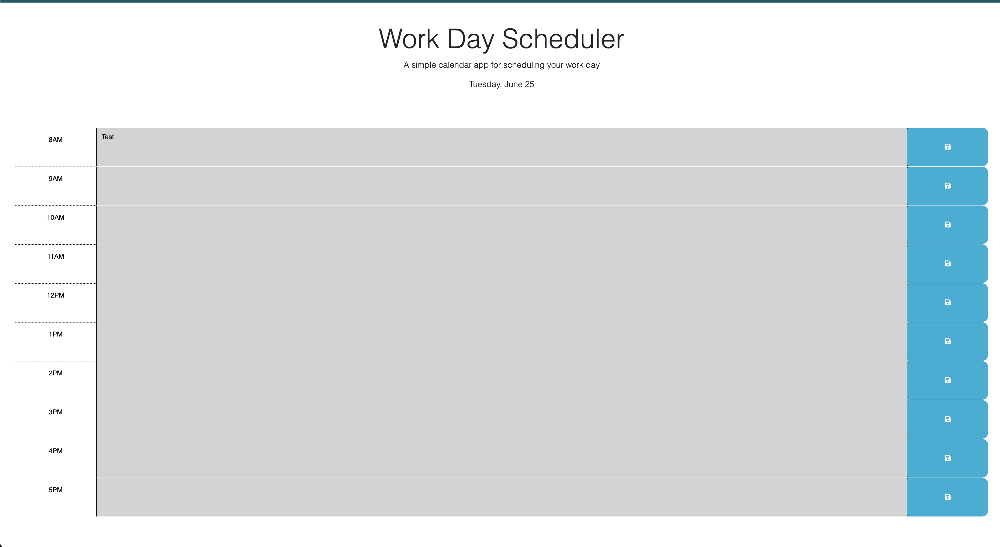

# WorkDayScheduler

## Description

My main goal with this project was to familiarize myself with manipulating the DOM with javascript and jquery. I struggled with jquery so I found myself writing this code in plain/vanilla javascript. I'm going to try to rewrite my function using jquery to get more comfortable. This project's purpose is to create an interactive workday schedule that dynamically updates. It also color codes the events to helps users quickly identify past, present and future calendar events!

I've learned that I need to work on my approach - I spent too much time trying to figure out what functions to create > then I would create a function and then realize that the function I created did not work/accept input from ALL the calendar timestamps.

Local storage was a huge headache - I tried to figure out how to append instead of writing over the current value in local storage. I ended up creeating a variable to pull the id attribute and set that as the key (I gave up and found an alternative that made more sense to me but I will look into it further, haha)

## Installation

Here is the deployed link:
https://love4tau.github.io/workDayScheduler/

## Usage

## Credits

I relied heavily on the xpert AI to explain how save to and use values in local storage > etc.
https://bootcampspot.instructure.com/courses/5093/external_tools/313

My teacher helped me with the local storage as well - Robbert Wijtman

https://www.w3schools.com/js/js_this.asp - rewatched bootcamp zoom videos to gain a better understanding of 'this'

Lots of stack overflow LOL 

https://stackoverflow.com/questions/60976716/javascript-how-can-i-store-instances-of-a-class-in-localstorage

https://stackoverflow.com/questions/48769877/save-to-localstorage-with-html-jquery

https://www.geeksforgeeks.org/how-to-get-the-value-of-a-textarea-in-jquery/